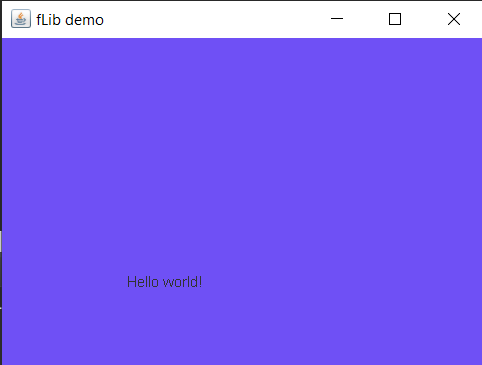

# fLib
A simple Java library that aims to simplify JFrame creation and customization
- Simple to use
- File sizes are lightweight


# Usage

	Download fLib's source code and compile it
- Export the code to a JAR file**
- Include the JAR file into your program after you added it to your classpath
- **This is done because not many people trust the executable JAR so you can check the code before-hand and compile it safely


# Examples
```
import flib.flib;
public class Example extends flib{
	public static void main(String[]args) {
		setBackg(111, 80, 245);
    		frameTitle("fLib demo");
		setSiz(400, 300);
		isVis(true);
		closeOp(3);
		drawStr("Hello world!", 100,200);
	}
}
```

This will create a frame with the text "Hello world!" and a background image
  
